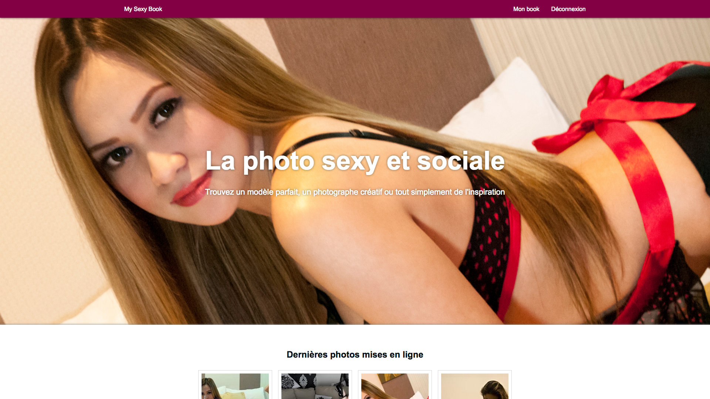

# My Sexy Book



## Requirements

* [`Node.js`](nodejs.org) + `npm`
* [`MongoDB`](https://www.mongodb.org/)
* [`GraphicsMagick`](http://www.graphicsmagick.org/)
* [`forever`](https://github.com/foreverjs/forever) (Node module)
* [`LESS.js`](http://lesscss.org/) (Node module)

[](https://www.versioneye.com/user/projects/5566d82b6138360018270100)

## Running the site

### Locally

#### Compile LESS files

```
lessc -x public/css/mysexybook.less public/css/mysexybook.min.css
```
#### Start servers (one time only)

```
npm run-script test
```

And to restart them (without checking NPM podules)

```
npm run-script test-again
```

### In production (using forever)

If you haven't already compiled the LESS files to CSS, check a few lines higher…

#### Start servers (using forever)

```
NODE_ENV=production forever start ./ -c "npm run-script start"
```

#### Start servers (one time only)

If you prefer starting the server once (just to test it, maybe), you can use the npm script directly

```
npm run-script start
```

## License

All source code is proprietary, except for external resources (such as `npm` modules).

You may test it, hack it, but not modify it, sell it or share it without permission.

Other resources (images, data, etc.) belong to their respective owners.