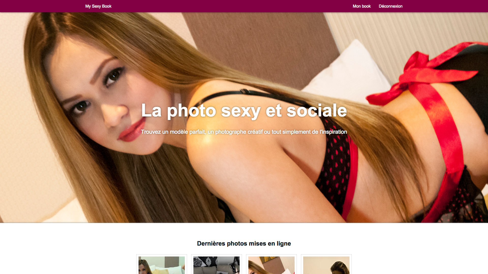

# My Sexy Book



## Requirements

* Composer
* Laravel (`composer global require "laravel/installer"`)

## Running the site

### Locally

```shell
php -S localhost:6969 -t public/
```

### In production
